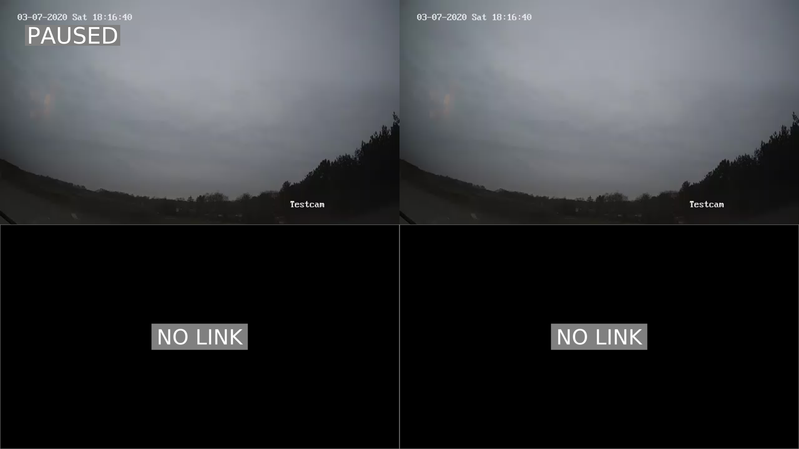

# Camplayer - IP Camera viewer for the Raspberry Pi
Use your Raspberry Pi as advanced IP camera viewer.
The list of supported IP cameras is endless as Camplayer makes use of the RTSP and HTTP protocols for streaming.
Especially the RTSP protocol is supported by nearly all big brands out there.

 A picture is worth a thousand words.  

 

## Website
[https://www.rpi-camplayer.com/](https://www.rpi-camplayer.com/)

## Donate
Please consider a donation if you like this software or want to support its ongoing development.

<a href="https://www.paypal.com/cgi-bin/webscr?cmd=_s-xclick&hosted_button_id=ZJMX4ZWEUCP22&source=url" target="_blank" rel="nofollow"></a>

Donators who donate €10 or more can get early access to CAMPLAYER OS.  
CAMPLAYER OS is a linux based OS packed with camplayer and additional features like:  

* Plug and play system.
* GUI for system and camplayer configuration (no more messing with config files).
* CEC remote control support.
* Support for dynamic IP addresses.
* Read-only mode to prevent SD card corruption.  
* ...

You can find more information about CAMPLAYER OS here:
https://github.com/raspicamplayer/camplayer_os

## Features
* MPEG2, H264, MJPEG and experimental HEVC support (see support matrix).
* Video grid for up to 16 streams.
* Switch from grid to single view mode (zoom mode) and back.
* Substream/subchannel support with automatic selection.
* Automatic recovery of broken streams.
* Keyboard navigation.
* Easy configuration with .ini file
* Experimental audio support.
* Dual display support for the Raspberry Pi 4.
* OSD and background support.
* Demo mode.

## Support matrix
|                        | Raspberry Pi Zero | Raspberry Pi 2 | Raspberry Pi 3/3+ | Raspberry Pi 4 |
|:----------------------:|:-----------------:|:--------------:|:-----------------:|:--------------:|
| H264                   | Yes               | Yes            | Yes               | Yes            |
| H265/HEVC              | No                | No             | Yes (1,4)         | Yes (2,4)      |
| MPEG2                  | Yes               | Yes            | Yes               | Yes (3,4)      |
| Dual display           | No                | No             | No                | Yes (4)        |
| Video OSD              | Yes               | Yes            | Yes               | No             |

(1) Full screen mode only, up to 1080p/FHD.  
(2) Full screen mode only, up to 2160p/4K.  
(3) Full screen mode only.  
(4) Experimental.  

General notes:  
* The maximum resolution for MJPEG, H264 and MPEG2 is 1920x1080.  
* You need to buy a license key for MPEG2.

## How many windows in grid view mode?

The maximum number of windows/video players in grid view mode depends on many factors  
including display resolution, video resolution, framerate, codec, Pi hardware etc.  

The tables below give you an idea of what to expect with some common video resolutions.  

### Single display 1920x1080@60Hz  

|                             | Raspberry Pi Zero | Raspberry Pi 2 | Raspberry Pi 3/3+ | Raspberry Pi 4 |
|:---------------------------:|:-----------------:|:--------------:|:-----------------:|:--------------:|
| H264 640x360@24FPS          | ?                 | ?              | 9                 | 9              |
| H264 854x480@24FPS          | ?                 | ?              | 7                 | 7              |
| H264 1280x720@24FPS         | ?                 | ?              | 4                 | 4              |
| H264 1920x1080@24FPS        | 1                 | 1              | 1                 | 1              |

### Dual display 1920x1080@60Hz

|                             | Raspberry Pi Zero | Raspberry Pi 2 | Raspberry Pi 3/3+ | Raspberry Pi 4 |
|:---------------------------:|:-----------------:|:--------------:|:-----------------:|:--------------:|
| H264 640x360@24FPS          | N/A               | N/A            | N/A               | 4 + 6          |
| H264 854x480@24FPS          | N/A               | N/A            | N/A               | 1 + 6          |


You can easely perform your own performance tests by running one of the test configs.

```
camplayer -c ../tests/test-performance_360pH264-config.ini
```

## Security warnings

* Password protected HTTP and RTSP streams are widely used on security cameras but are not 100% secure as these streams are still unencrypted. 
The only thing that is protected here is the login procedure.
* Anyone with physical access to your Raspberry Pi and/or SD card can potentially retrieve your IP camera credentials.
Passwords and usernames are saved as plain text.
* It's better to disable SSH or at least change the default password.

Therefore, please don't use this software if security is critical for you.
I take no responsibility for leaked footage, leaked credentials, hacked cameras etc., you have been warned!

## Installation

The instruction below assume you are running a recent Raspberry Pi OS Lite build.  

Add the following lines to '/boot/config.txt':  
```
gpu_mem=256
disable_overscan=1
```

Comment out (or delete) the following line in '/boot/config.txt' and reboot:  
```
# dtoverlay=vc4-fkms-v3d
```

Install git client:  
```
sudo apt-get update
sudo apt-get install git
```

Get the source code and check it out in the current directory:  
```
git clone -b Camplayer_1.0 https://github.com/raspicamplayer/camplayer.git
```

Install camplayer by running the install script:  
```
sudo sh ./camplayer/install.sh
```

Now you can test your install with:  
```
camplayer --demo
```

After you finished your configuration (see next section), you can start camplayer with:  
```
sudo systemctl start camplayer.service
```

To automatically start camplayer at boot:  
```
sudo systemctl enable camplayer.service
```

To stop camplayer:  
```
sudo systemctl stop camplayer.service
```
or  
Press "q" key.

## Experimental HEVC/H265 support
You have to install an experimental VLC media player version,  
please follow the instructions of the following thread.  
https://www.raspberrypi.org/forums/viewtopic.php?f=29&t=257395  
  
It is important to note that VLC does not support windowed playback at the moment, so you can not create a grid layout of HEVC/H265 streams.
Once VLC supports this, I will probably drop OMXplayer support and rewrite the windowmanager code in a less hackish way.

## Configuration
### Getting started 
Create and open following file (assumes you are running as user 'pi')  
```
/home/pi/.camplayer/config.ini
```

Create device section(s).  

```ini
[DEVICE1]
channel1_name = optional OSD name
channel1.1_url = your 1st IP camera stream URL (main stream)
channel1.2_url = your 1st IP camera stream URL (sub stream)

[DEVICE2]
channel1_name = optional OSD name
channel1.1_url = your 2nd IP camera stream URL (main stream)
channel1.2_url = your 2nd IP camera stream URL (sub stream)
```
It is important that device sections are named "**[DEVICEx]**" and channels are named "**channelx.y_url**".  
At least 1 sub-channel must be added, up to 9 sub-channels are possible.

Create screen section(s)

```ini
[SCREEN1]
layout = 4
window1 = device1,channel1
window2 = device1,channel1
window3 = device2,channel1
window4 = device2,channel1
```
It is important that screen sections are named "**[SCREENx]**" and windows are named "**windowx**".  
The window values should be formatted as "**devicex,channelx**" and match the desired device section and channel you created in previous step.  
  
Another important point is that "**layout**" must be one of the following numbers "**1,4,6,7,8,9,10,13,16***"  
This number defines the layout and the number of windows per screen e.g. a layout of "6" gives you the following layout:  
https://github.com/raspicamplayer/camplayer/blob/master/resources/backgrounds/nolink_1P5.png  
  
You can find an overview of possible layouts here:  
https://github.com/raspicamplayer/camplayer/tree/master/resources/backgrounds

### Raspberry Pi dual display
First of all, camplayer assumes that both displays are set to the same resolution. So please verify this and if nessesary adjust your display configuration.
Now, to display a screen on the second HDMI (HDMI1), you have to add a 'display = 2' property to the desired SCREEN section.  

```ini
[SCREEN1]
display = 2
layout = 4
window1 = device1,channel1
...
```

## Troubleshooting

### Check logging output

To be sure all instances are stopped:  
```
sudo systemctl stop camplayer.service
```

Run camplayer from command line without 'sudo':  
```
camplayer
```

Check the output of this command for errors and/or warnings.  
  
* For the Raspberry pi 4, use the HDMI0 labeled output
* Unsupported hardware? -> see 'hardwarecheck' in advanced settings, no guarantee!
* H265/HEVC streams are not supported in grid mode!  

## Performance impact

You can experience HDMI signal dropouts and/or video artifacts when your configuration exeeds the capabilities of your Raspberry Pi's GPU.
It is hard to predict this in advance as it depends on many factors like.

* Video resolution and framerate
* Display resolution
* GPU/H264 decoder clock frequency
* Number of connected displays
* Background mode (advanced setting)
* Screen downscaling (advanced setting)
* Video OSD (advanced setting)

When in trouble, you can reduce the number of windows in the gridview to reduce the performance impact.  
Other options you can try are:  

* Set advanced setting "streamquality" to "0" (lowest quality)
* Set advanced setting "backgroundmode" to "0" (black background)
* Set advanced setting "screenchangeover" to "0" (normal changeover)
* Don't set advanced setting "screendownscale"
* Don't set advanced setting "enablevideoosd"
* Use a faster/newer Raspberry Pi model
* Reduce resolution/framerate inside your IP camera configuration
* Scaling the video resolution to the window resolution comes at a cost, a perfect match is preferred.  
You can achieve this by chosing your IP camera and/or display resolution carefully.  
Important to note, upscaling is still better than downscaling performance wise.  

## Advanced settings

You can change advanced settings by adding an "ADVANCED" section to your configuration file.  
In this example we set the video buffertime to 1000ms.

### Example
```ini
[ADVANCED]
buffertime = 1000
```

### Possible advanced settings

```
showtime            Screen rotation interval in seconds when multiple screens are configured (0=no automatic rotation).
loglevel            Log level (0=debug, 1=info, 2=warning, 3=error).
hardwarecheck       Check hardware capabilities on startup (0=off, 1=on).
backgroundmode      Use background image, pipng install required 
                    (0=black, 1=static grid background, 2=dynamic background, 3=off).
buffertime          Video buffertime in millisecond.
screenchangeover    Changeover mode with multiple screens (0=normal, 1=fast, 2=smooth).
icons               Enable loading, paused, ... icons on top of the video (0=off, 1=on).
streamwatchdog      Check and repair broken video streams interval in seconds (0=off, 1=on).
playtimeout         Video play timeout in seconds.
streamquality       Stream selection when multiple subchannels are defined 
                    (0=lowest quality, 1=automatic, 2=highest quality).
refreshtime         Refresh streams interval in minutes.
enablehevc          HEVC/H265 support (0=disable, 1=auto select from hardware, 2=limit to FHD/1080p, 3=force on).
enableaudio         Enable audio support for fullscreen playing video. (0=off, 1=on when fullscreen).
screendownscale     Downscale the used screen area (adds a black border) in percent.
enablevideoosd      Show channel/camera name on top of each video (0=off, 1=on).
audiovolume         Default audio volume (0..100).
screendownscale     Downscale the virtual screen by x percent (0..100).
screenwidth         Forced screen width in pixels (if autodetect fails).
screenheight        Forced screen height in pixels (if autodetect fails).
```
## Key bindings
```
space               Pause/unpause automatic screen rotation.
enter               Switch from grid to single view mode.
left/right arrow    Switch to previous/next screen (or window in single view mode).
up/down arrow       Increase/decrease stream quality (if multiple subchannels/substreams configured).
numeric keys 1..16  Switch from grid view mode to the relevant window in fullscreen (single view mode).
numeric key 0       Switch from single view to grid view mode and unpause rotation.
escape              Switch from single view to grid view mode and unpause rotation.
letter 'q'          Quit camplayer.
```

## Roadmap
### Camplayer 2
* Improve VLC and drop OMXplayer support, drop code hacks introduced to support them both.
* Proper windowed H265/HEVC playback, related to previous point.
* PTZ support by calling external scripts.
* Proper audio support.
